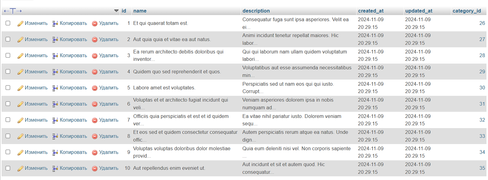
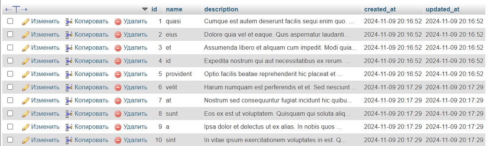
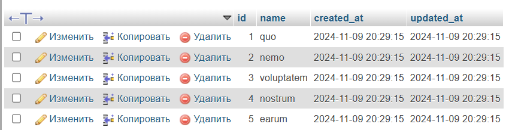

# Лабораторная работа №3. Основы работы с базами данных в Laravel

## Цель работы

Познакомиться с основными принципами работы с базами данных в Laravel. Научиться создавать миграции, модели и сиды на основе веб-приложения `To-Do App`.

## Условие


В данной лабораторной работе вы продолжите разработку приложения `To-Do App` для команд, начатого в предыдущих лабораторных работах.

Вы добавите функциональность работы с базой данных, создадите модели и миграции, настроите связи между моделями и научитесь использовать фабрики и сиды для генерации тестовых данных.

### №1. Подготовка к работе

1.  Установливаю СУБД MySQL.
2.  Создаю новую базу данных для приложения `todo_app`.
3.  Настраиваю переменные окружения в файле `.env` для подключения к базе данных: 
``` 
DB_CONNECTION=mysql
DB_HOST=127.0.0.1 
DB_PORT=3307
DB_DATABASE=db_todo 
```

### №2. Создание моделей и миграций


1.  Создаю модель `Category` --- категория задачи.
    -   `php artisan make:model Category -m`
2.  Определение структуры таблицы `category` в миграции:
    -   Добавляю поля:
        -   `id` --- первичный ключ;
        -   `name` --- название категории;
        -   `description` --- описание категории;
        -   `created_at` --- дата создания категории;
        -   `updated_at` --- дата обновления категории.

```php
public function up(): void
    {
        Schema::create('categories', function (Blueprint $table) {
            $table->id();
            $table->string('name');
            $table->text('description')->nullable();
            $table->timestamps();
            
        });
    }
```


3.  Создаю модель `Task` --- задача.
    -   `php artisan make:model Category -m`
4.  Определение структуры таблицы `task` в миграции:
    -   Добавляю поля:
        -   `id` --- первичный ключ;
        -   `title` --- название задачи;
        -   `description` --- описание задачи;
        -   `created_at` --- дата создания задачи;
        -   `updated_at` --- дата обновления задачи.

```php
 public function up(): void
    {
        Schema::create('tasks', function (Blueprint $table) {
            $table->id();
            $table->string('name');
            $table->text('description')->nullable();
            $table->timestamps();
        });
    }
```

5.  Запускаю миграцию для создания таблицы в базе данных: 
```bash 
php artisan migrate
```
6.  Создайте модель `Tag` --- тег задачи.
```bash
php artisan make:model Tag -m
```
7.  Определение структуры таблицы tag в миграции:
    -   Добавьте поля:
        -   `id` --- первичный ключ;
        -   `name` --- название тега;
        -   `created_at` --- дата создания тега;
        -   `updated_at` --- дата обновления тега.

```php
public function up(): void
    {
        Schema::create('tags', function (Blueprint $table) {
            $table->id();
            $table->string('name');
            $table->timestamps();
        });
    }
```
8.  Добавляю поле `$fillable` в модели `Task`, `Category` и `Tag` для массового заполнения данных.

```php
// Task
protected $fillable = ['name', 'description'];

// Tag
protected $fillable = ['name'];

// Category
protected $fillable = ['name', 'description'];
```

### №3. Связь между таблицами


1.  Создаю миграцию для добавления поля `category_id` в таблицу task.
    -   `php artisan make:migration add_category_id_to_tasks_table --table=tasks`
    -   Определяю структуру поля `category_id` и добавляю внешний ключ для связи с таблицей category.

    ```php
    Schema::table('tasks', function (Blueprint $table) {
            $table->foreignId('category_id')->constrained()->onDelete('cascade');
        });
    ```
2.  Создаю промежуточную таблицу для связи многие ко многим между задачами и тегами:
    -   `php artisan make:migration create_task_tag_table`
3.  Определение соответствующей структуры таблицы в миграции.
    -   Данная таблица должна связывать задачи и теги по их идентификаторам.
    -   Например: `task_id` и `tag_id`: `10` задача связана с `5` тегом.
    ```php
    Schema::create('task_tag', function (Blueprint $table) {
            $table->foreignId('task_id')->constrained()->onDelete('cascade');
            $table->foreignId('tag_id')->constrained()->onDelete('cascade');
        });
    ```

4.  Запускаю миграцию для создания таблицы в базе данных.
   ```php
    php artisan migrate
   ```

### №4. Связи между моделями

1.  Добавляю отношения в модель `Category` (Категория может иметь много задач)
    -   Открываю модель `Category` и добавляю метод: 
    ```php
    public function tasks() 
    { 
        return $this->hasMany(Task::class); 
    }
    ```

2.  Добавляю отношения в модель `Task`
    -   Задача прикреплена к одной категории.
    ```php
    public function categories()
    {
        return $this->belongsTo(Category::class);
    }
    ```
    -   Задача может иметь много тегов.
    ```php
    public function tags()
    {
        return $this->hasMany(Tag::class);
    }
    ```

3.  Добавляю отношения в модель `Tag` (Тег может быть прикреплен к многим задачам)
    ```php
    public function tasks()
    {
        return $this->belongsToMany(Task::class);
    }
    ```
4.  Добавляю соответствующие поля в `$fillable` моделей. 

    ( `category_id` в модель `Task`)

### №5. Создание фабрик и сидов

1.  Создаю фабрику для модели `Category`:
    -   `php artisan make:factory CategoryFactory --model=Category`
    -   Определяю структуру данных для генерации категорий.
    ```php
    public function definition(): array
    {
        return [
            'name' => $this->faker->word(),
            'description' => $this->faker->text(),
        ];
    }
    ```
2.  Создаю фабрику для модели `Task`.
    -   `php artisan make:factory TaskFactory --model=Task`
    ```php

    ```
3.  Создаю фабрику для модели `Tag`.
    -   `php artisan make:factory TagFactory --model=Tag`
4.  Создаю сиды (`seeders`) для заполнения таблиц начальными данными для моделей: `Category`, `Task`, `Tag`.
    ```
    php artisan make:seeder CategorySeeder
    php artisan make:seeder TaskSeeder
    php artisan make:seeder TagSeeder
    ```

   Прописываю сколько записей хочу задать.
   ```php
   Category::factory(5)->create();
   Task::factory(10)->create();
   Tag::factory(5)->create();
   ```

5.  Обновляю файл `DatabaseSeeder` для запуска сидов и запустите их: `bash php artisan db:seed`
    ```php
    $this->call([
            CategorySeeder::class,
            TaskSeeder::class,
            TagSeeder::class,
        ]);
    ```

__Таблица `Tasks`__

 <br>

Таблица `Categories`:

 <br>

Таблица `Tags`:

 <br>

### №6. Работа с контроллерами и представлениями

1.  Открываю контроллер `TaskController` (`app/Http/Controllers/TaskController.php`).
2.  Обновляю метод `index` для получения списка задач из базы данных.
    ```php
    public function index()
    {
        $tasks = Task::with(['categories', 'tags'])->get();
        return view('tasks.index', compact('tasks'));
    }
    ```
3.  Обновляю метод `show` для отображения отдельной задачи.
    -   Отображаю информацию о задаче по ее идентификатору
    -   Отображаю категорию и теги задачи.
    ```php
    public function show($id)
    {
    $task = Task::with(['categories', 'tags'])->findOrFail($id);
    return view('tasks.show', compact('task'));
    }
    ```
4.  В методах `index` и `show` используется метод `with` (Eager Loading) для загрузки связанных моделей.
5.  Обновила соответствующие представления для отображения списка задач и отдельной задачи.
6.  Обновите метод `create` для отображения формы создания задачи и метод `store` для сохранения новой задачи в базе данных.
    -   Примечание: Поскольку вы ещё не изучали работу с формами, используйте объект `Request` для получения данных.
    ```php
    public function create()
    {
        $categories = Category::all();
        $tags = Tag::all();
        return view('tasks.create', compact('categories', 'tags'));
    }

    ```
7.  Обновите метод `edit` для отображения формы редактирования задачи и метод `update` для сохранения изменений в базе данных.
    ```php
    public function edit($id)
    {
        $task = Task::with(['categories', 'tags'])->findOrFail($id);
        $categories = Category::all();
        $tags = Tag::all();

        return view('tasks.edit', compact('task', 'categories', 'tags'));
    }
    ```
8.  Обновите метод `destroy` для удаления задачи из базы данных.
    ```php
    public function destroy($id)
    {
        $task = Task::findOrFail($id);
        $task->delete();
        return redirect()->route('tasks.index')->with('success', 'Задача успешно удалена');
    }
    ```
9. Содержимое файла `TaskController.php`
    ```php
        <?php

    namespace App\Http\Controllers;

    use App\Models\Category;
    use App\Models\Tag;
    use App\Models\Task;
    use Illuminate\Http\Request;

    class TaskController extends Controller
    {
        public function index()
        {
            $tasks = Task::with(['categories', 'tags'])->get();
            return view('tasks.index', compact('tasks'));
        }

        public function show($id)
        {
            $task = Task::with(['categories', 'tags'])->findOrFail($id);
            return view('tasks.show', compact('task'));
        }

        public function create()
        {
            $categories = Category::all();
            $tags = Tag::all();
            return view('tasks.create', compact('categories', 'tags'));
        }

        public function store(Request $request)
        {
            $request->validate([
                'name' => 'required|string|max:255',
                'description' => 'nullable|string',
                'category_id' => 'required|exists:categories,id'
            ]);

            $task = Task::create($request->only(['name', 'description', 'category_id']));

            if ($request->has('tags')) {
                $task->tags()->sync($request->input('tags'));
            }

            return redirect()->route('tasks.index')->with('success', 'Задача успешно создана');
        }

        public function edit($id)
        {
            $task = Task::with(['categories', 'tags'])->findOrFail($id);
            $categories = Category::all();
            $tags = Tag::all();

            return view('tasks.edit', compact('task', 'categories', 'tags'));
        }

        public function update(Request $request, $id)
        {
            $request->validate([
                'name' => 'required|string|max:255',
                'description' => 'nullable|string',
                'category_id' => 'required|exists:categories,id'
            ]);

            $task = Task::findOrFail($id);
            $task->update($request->only(['name', 'description', 'category_id']));

            if ($request->has('tags')) {
                $task->tags()->sync($request->input('tags'));
            }

            return redirect()->route('tasks.show', $task->id)->with('success', 'Задача успешно обновлена');
        }

        public function destroy($id)
        {
            $task = Task::findOrFail($id);
            $task->delete();
            return redirect()->route('tasks.index')->with('success', 'Задача успешно удалена');
        }
    }
    ```

Контрольные вопросы
-------------------

1.  Что такое миграции и для чего они используются?
>__Миграция__ — это процесс внесения изменений в структуру базы данных. Миграции помогают управлять изменениями в базе данных, особенно в проектах, где база данных развивается вместе с приложением.
2.  Что такое фабрики и сиды, и как они упрощают процесс разработки и тестирования?
>__Фабрики__ — это специальные классы или функции, которые создают объекты с заранее определёнными значениями. Используются для создания экземпляров моделей с заполненными полями.  
__Сиды__ (или сидеры) — это классы, которые добавляют начальные данные в базу данных. В отличие от фабрик, сиды обычно заполняют базу конкретными значениями, которые могут быть необходимы для работы приложения.  
Они упрощают разработку, позволяя автоматически создавать большое количество записей вместо ручного заполнения данных. Это значительно ускоряет процесс, а тесты выполняются с одинаковыми данными, что делает поиск ошибок проще и надежнее.
3.  Что такое ORM? В чем различия между паттернами `DataMapper` и `ActiveRecord`?
>__ORM__ - (Object Relative Mapping) - это паттерн проектирования, который позволяет наладить взаимосвязь между классом и таблицей в Базе Данных.  
__Различия между ActiveRecord и DataMapper__
>-   **Уровень связи с базой данных**: ActiveRecord напрямую привязывает модель к базе данных, а DataMapper работает через отдельный слой.
>-   **Гибкость**: DataMapper лучше для сложных приложений с разной бизнес-логикой, тогда как ActiveRecord подходит для более простых и средних проектов.
>-   **Простота в использовании**: ActiveRecord легче понять и использовать, но менее гибок для расширенных бизнес-требований.
4.  В чем преимущества использования ORM по сравнению с прямыми SQL-запросами?
>ORM помогает обойтись без ручных трансформаций данных и позволяет вообще не использовать SQL, а вести работу с базами через привычные языки программирования.  
Преимущество объектно-реляционного отображения в том, что оно абстрагируется от базы данных; программисту не нужно возиться с деталями .
5.  Что такое транзакции и зачем они нужны при работе с базами данных?
>__Транзакция__ — это набор операций с базой данных, которые выполняются как единое целое: либо все успешно, либо ничего. Они нужны, чтобы гарантировать целостность данных — если одна из операций внутри транзакции не удаётся, все изменения отменяются, и база данных возвращается в исходное состояние.