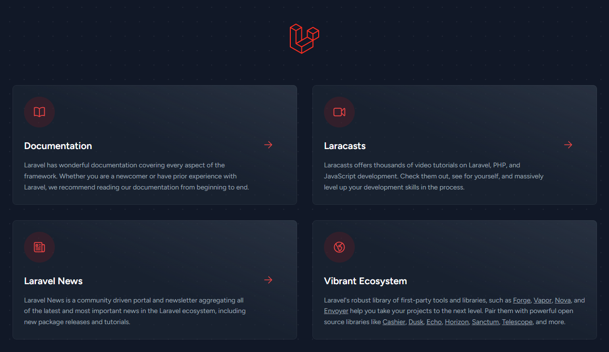
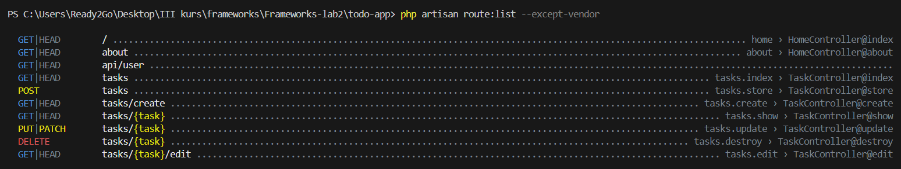
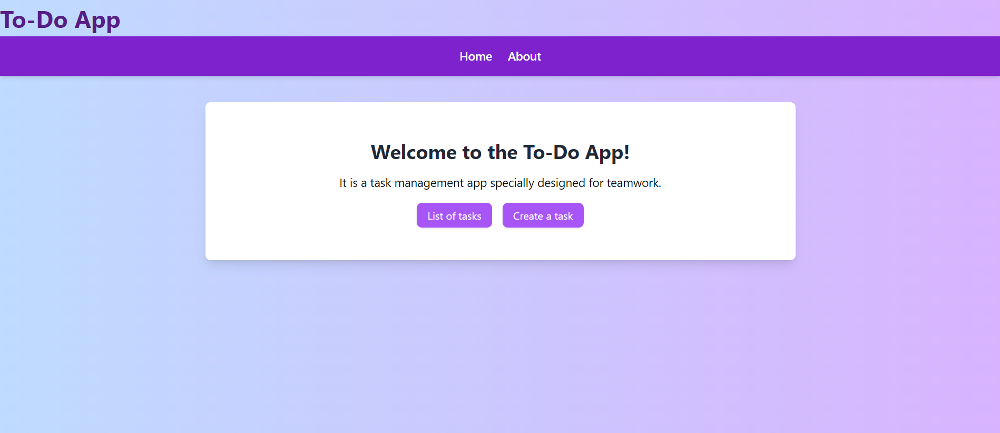
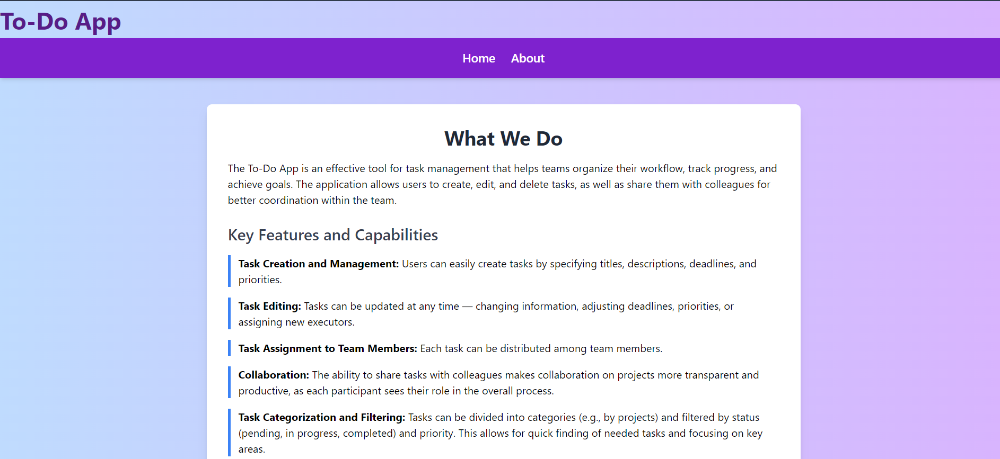
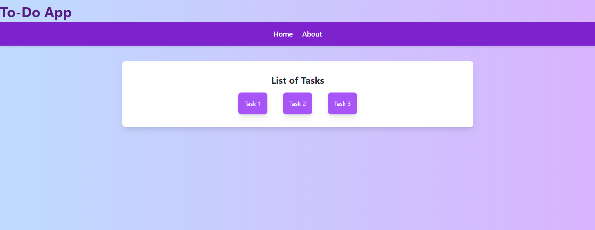
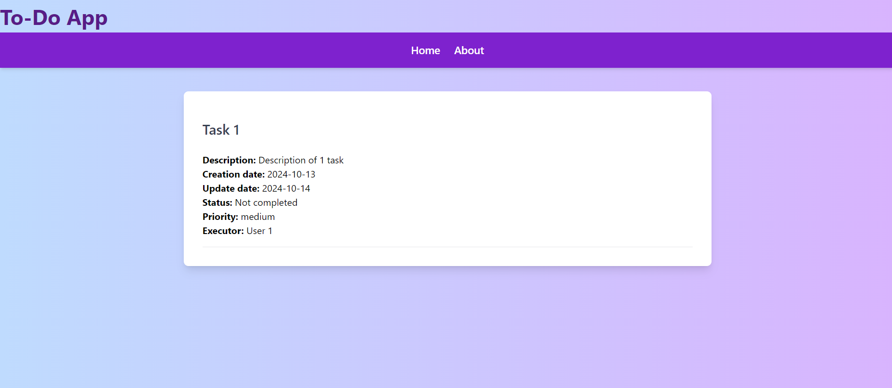

Лабораторная работа №2. HTTP-запросы и шаблонизация в Laravel
=============================================================

Цель работы
-----------

Изучить основные принципы работы с HTTP-запросами в Laravel и шаблонизацию с использованием Blade на основе веб-приложения `To-Do App для команд` --- приложения для управления задачами внутри команды.

Приложение предназначено для команды, которая хочет управлять своими задачами, назначать их участникам, отслеживать статус и приоритет задач (похоже на Github Issues).

Условие
-------

### №1. Подготовка к работе, установка Laravel

1. Открываю терминал и создаю проект Laravel с именем todo-app
```bash
composer create-project laravel/laravel:^10 todo-app
```
2. Перехожу в директорию проекта:
```bash
 cd todo-app
 ```
 3. Запускаю встроенный сервер Laravel: 
 ```bash 
 php artisan serve 
 ```

 __Вопрос__: Что я вижу в браузере, открыв страницу http://localhost:8000?
 __Ответ__: Перейдя по ссылке, я вижу базовую стартовую страницу Laravel с приветствием и основными предложениями.
 

 ### №2. Настройка окружения

 1. Открываю файл `.env` и указываю следующие настройки приложения: 
 ```
 APP_NAME=ToDoApp 
 APP_ENV=local 
 APP_KEY= 
 APP_DEBUG=true 
 APP_URL=http://localhost:8000
 ```
2. Генерирую ключ приложения
```bash
php artisan key:generate
```
__Вопрос__: Что будет, если данный ключ попадет в руки злоумышленника?

__Ответ__: Если данный ключ попадт в руки злоумышленника,это может привести к серьёзным проблемам безопасности. Этот ключ используется для шифрования и расшифровки данных, таких как:
- конфиденциальные данные;
- сессии пользователей;
- токены CSRF.

### №3. Основы работы с HTTP-запросами

#### №3.1. Создание маршрутов для главной страницы и страницы "О нас"

1.  Создаю класс-контроллер `HomeController` для обработки запросов на главную страницу.
```bash
php artisan make:controller HomeController
```
2.  Добавляю метод `index` в `HomeController`, который будет отвечать за отображение главной страницы.
```php
public function index()
    {
        return view('home');
    }
```
3.  Создаю маршрут для главной страницы в файле `routes/web.php`. 
```php
Route::get('/', [HomeController::class, 'index'])->name('home');
```
-   Открываю браузер и перехожу по адресу `http://localhost:8000`. 
- Убеждаюсь, что загружается пустая страница, так как представление `home.blade.php` пока не создано.


4.  В этом же контроллере `HomeController` создаю метод для страницы "О нас".
```php
public function about()
    {
        return view('about');
    }
```
5.  Добавляю маршрут для страницы "О нас" в файле `routes/web.php`.
```php
Route::get('/about', [HomeController::class, 'about'])->name('about');
```

#### №3.2. Создание маршрутов для задач

1. Создаю класс-контроллер `TaskController` для обработки запросов, связанных с задачами, и добавляю следующие методы:

-   `index` --- отображение списка задач;
-   `create` --- отображение формы создания задачи;
-   `store` --- сохранение новой задачи;
-   `show` --- отображение задачи;
-   `edit` --- отображение формы редактирования задачи;
-   `update` --- обновление задачи;
-   `destroy` --- удаление задачи.

```php
class TaskController extends Controller
{
    public function index()
    {
        return 'This is a list of tasks';
    }

    public function create()
    {
        // 
    }

    public function store(Request $request)
    {
        // 
    }

    public function show($id)
    {
        return "This is the task with id: $id";
    }

    public function edit($id)
    {
        // 
    }

    public function update(Request $request, $id)
    {
        //
    }

    public function destroy($id)
    {
        // 
    }
}
```
6. Добавляю маршруты для TaskController с использованием ресурса
```php
Route::resource('tasks', App\Http\Controllers\TaskController::class);
```
__Вопрос__: Объясните разницу между ручным созданием маршрутов и использованием ресурсного контроллера. Какие маршруты и имена маршрутов будут созданы автоматически?  

__Ответ:__

***Ручное создание маршрутов***: Когда создаются маршруты вручную, нужно для каждого метода контроллера прописать отдельный маршрут, указать HTTP-метод и имя маршрута. 
Это даёт вам полный контроль над маршрутами, но требует больше кода и становится громоздким для больших приложений.

***Ресурсный контроллер***: автоматически генерирует маршруты для всех стандартных операций (CRUD) в Laravel. Это уменьшает количество кода и автоматически назначает имена маршрутов.

7. Проверяю созданные маршруты с помощью команды 
```php
php artisan route:list
```
 

### №4. Шаблонизация с использованием Blade

#### №4.1. Создание макета страницы

1.  Создаю макет основных страниц `layouts/app.blade.php` с общими элементами страницы:
    1.  Заголовок страницы;
    2.  Меню навигации;
    3.  Контент страницы.
2.  Использую директиву `@yield` для определения области, в которую будут вставляться содержимое различных страниц.


```php
<!DOCTYPE html>
<html lang="en">
<head>
    <meta charset="UTF-8">
    <meta name="viewport" content="width=device-width, initial-scale=1.0">
    <title>@yield('title')</title>
    <link rel="stylesheet" href="{{ asset('css/app.css') }}">
</head>
<body>
    <nav>
        <ul>
            <li><a href="{{ url('/') }}">Главная</a></li>
            <li><a href="{{ url('/about') }}">О нас</a></li>
            <li><a href="{{ url('/contact') }}">Контакты</a></li>
        </ul>
    </nav>
    <div class="content">
        @yield('content')
    </div>
    <script src="{{ asset('js/app.js') }}"></script>
</body>
</html>
```

#### №4.2. Использование шаблонов Blade

1.  Создаю представление для главной страницы `home.blade.php` с использованием макета `layouts/app.blade.php` в каталоге `resources/views`.
2.  На главной странице должно быть:
    1.  Приветственное сообщение: заголовок и краткое описание приложения, например "To-Do App для команд".
    2.  Навигация: ссылки на основные разделы, такие как:
    -   Список задач;
    -   Создание задачи.
        1.  Информация о приложении: краткое описание назначения приложения и его основных функций.


3.  Создаю представление для страницы "О нас" --- `about.blade.php` с использованием макета `layouts/app.blade.php` в каталоге `resources/views`.


4.  Создаю представления для задач со следующими шаблонами в каталоге `resources/views/tasks`:
    -   `index.blade.php` --- список задач;
    -   `show.blade.php` --- отображение задачи;
    -   ...
5.  Следом надо отрендерить список задач на странице `index.blade.php` с использованием статических данных, передаваемых из контроллера с помощью директивы `@foreach`.

#### №4.3. Анонимные компоненты Blade

1.  Создаю анонимный компонент для отображения `header`. Использую созданный компонент в макете `layouts/app.blade.php`.
```php
<header>
    <h1 class='header-title'>To-Do App</h1>
    <nav>
        <ul>
            <li><a href="{{ url('/') }}">Home</a></li>
            <li><a href="{{ url('/about') }}">About</a></li>
        </ul>
    </nav>
</header>
```

2.  Создаю анонимный компонент для отображения задачи:
    1.  Компонент должен быть простым и использовать передаваемые параметры с помощью директивы `@props`. Это сделает шаблоны более гибкими и переиспользуемыми на различных страницах.
    2.  Компонент должен отображать информацию о задаче:
        1.  Название задачи;
        2.  Описание задачи;
        3.  Дата создания задачи;
        4.  Дата обновления задачи;
        5.  Действия над задачей (редактирование, удаление);
        6.  Статус задачи (выполнена/не выполнена);
        7.  Приоритет задачи (низкий/средний/высокий);
        8.  Исполнитель задачи (Assignment), то есть имя пользователя, которому назначена задача.

```php
@props(['task'])

<div class="task">
    <h2>{{ $task['title'] }}</h2>
    <p><strong>Description:</strong> {{ $task['description'] ?? 'Описание не указано.' }}</p>
    <p><strong>Creation date:</strong> {{ $task['created_at'] ?? 'Не указана' }}</p>
    <p><strong>Update date:</strong> {{ $task['updated_at'] ?? 'Не указана' }}</p>
    <p><strong>Status:</strong> {{ $task['status'] ? 'Completed' : 'Not completed' }}</p>
    <p><strong>Priority:</strong> {{ $task['priority'] }}</p>
    <p><strong>Executor:</strong> {{ $task['assigned_to'] ?? 'Не назначен' }}</p>

    </div>
</div>
```
3.  Отобразите созданный компонент задачи на странице `show.blade.php` с использованием передаваемых параметров.

```php
@extends('layouts.app')

@section('title', $task['title'])

@section('content')
    <x-task :task="$task" />
@endsection
```

#### №4.4. Стилизация страниц

1.  Добавляю стили для страниц .
2.  Создаю файл стилей `app.css` в каталоге `public/css` и подключаю его к макету `layouts/app.blade.php`.

Контрольные вопросы
-------------------

1.  Что такое ресурсный контроллер в Laravel и какие маршруты он создает? 
>__Ресурсный контроллер в Laravel__ обрабатывает стандартные операции CRUD для ресурса. Он создает следующие маршруты:
>
>-   `GET /resources` --- индекс (список ресурсов).
>-   `GET /resources/create` --- форма для создания.
>-   `POST /resources` --- сохранение нового ресурса.
>-   `GET /resources/{id}` --- показать ресурс.
>-   `GET /resources/{id}/edit` --- форма редактирования.
>-   `PUT/PATCH /resources/{id}` --- обновление ресурса.
>-   `DELETE /resources/{id}` --- удаление ресурса.
2.  Объясните разницу между ручным созданием маршрутов и использованием ресурсного контроллера.
>Ручное создание маршрутов требует указания каждого маршрута отдельно, что может привести к дублированию кода. Ресурсный контроллер автоматически создает маршруты для всех операций CRUD, упрощая управление и улучшая читаемость кода.
3.  Какие преимущества предоставляет использование анонимных компонентов Blade?
>Анонимные компоненты позволяют:
>
>-   Разделить шаблоны на переиспользуемые части.
>-   Параметризовать компоненты с помощью директивы `@props`.
>-   Уменьшить дублирование кода.
>-   Улучшить читаемость и поддержку шаблонов.
4.  Какие методы HTTP-запросов используются для выполнения операций CRUD?

>-   **Create**: `POST`
>-   **Read**: `GET`
>-   **Update**: `PUT` или `PATCH`
>-   **Delete**: `DELETE`

### Скриншоты с веб-браузера 
__Главная страница__ 
 

__Страница "About"__ 
 

__Страница "Tasks"__ 
 

__Описание одной из задачи__ 
 