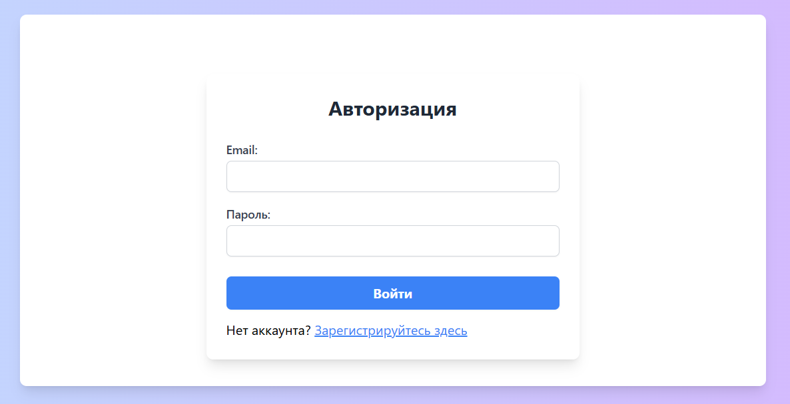

# Лабораторная работа №5. Компоненты безопасности в Laravel


## Цель работы

Познакомиться с основами компонентов безопасности в Laravel, таких как аутентификация, авторизация, защита от CSRF, а также использование встроенных механизмов для управления доступом.

Освоить подходы к безопасной разработке, включая создание защищенных маршрутов и управление ролями пользователей.

## Условие

В данной лабораторной работе вы реализуете основные компоненты безопасности, такие как аутентификация, авторизация, защита маршрутов и базовая работа с ролями. Дополнительно вы настроите механизм сброса пароля и исследуете логирование действий пользователя.

### №1. Подготовка к работе

1. Продолжаю работу с прошлым проектом.
2. Переменные окружения в `.env` настроены правильно, включая подключение к базе данных.

### №2. Аутентификация пользователей

1.  Создаю контроллер `AuthController` для управления аутентификацией пользователей. 

` php artisan make:controller AuthController`

2.  Добавляю и реализую методы для регистрации, входа и выхода пользователя.
    -   `register()` для отображения формы регистрации.
    -   `storeRegister()` для обработки данных формы регистрации.
    -   `login()` для отображения формы входа.
    -   `storeLogin()` для обработки данных формы входа. 
    ```php
        <?php

    namespace App\Http\Controllers;

    use Illuminate\Http\Request;
    use Illuminate\Support\Facades\Auth;
    use App\Models\User;
    use Illuminate\Support\Facades\Hash;

    class AuthController extends Controller
    {
        public function register()
        {
            return view('auth.register');
        }

        public function storeRegister(Request $request)
        {
            $validatedData = $request->validate([
                'name' => 'required|string|max:255',
                'email' => 'required|email|unique:users',
                'password' => 'required|string|min:8|confirmed',
            ]);

            User::create([
                'name' => $validatedData['name'],
                'email' => $validatedData['email'],
                'password' => Hash::make($validatedData['password']),
            ]);

            return redirect()->route('login')->with('success', 'Регистрация прошла успешно. Теперь вы можете войти.');
        }

        public function login()
        {
            return view('auth.login');
        }

        public function storeLogin(Request $request)
        {
            $credentials = $request->validate([
                'email' => 'required|email',
                'password' => 'required|string',
            ]);

            if (Auth::attempt($credentials)) {
                $request->session()->regenerate();
                return redirect()->route('dashboard')->with('success', 'Вы успешно вошли.');
            }

            return back()->withErrors(['email' => 'Неверные учетные данные.']);
        }

        public function logout(Request $request)
        {
            Auth::logout();
            $request->session()->invalidate();
            $request->session()->regenerateToken();
            return redirect()->route('login')->with('success', 'Вы успешно вышли.');
        }
    }
    ```
3.  Создаю маршруты для регистрации, входа и выхода пользователя. 

```php
use App\Http\Controllers\AuthController;

Route::get('/register', [AuthController::class, 'register'])->name('register');
Route::post('/register', [AuthController::class, 'storeRegister'])->name('storeRegister');
Route::get('/login', [AuthController::class, 'login'])->name('login');
Route::post('/login', [AuthController::class, 'storeLogin'])->name('storeLogin');
Route::post('/logout', [AuthController::class, 'logout'])->name('logout');

```
4.  Обновляю представления для форм регистрации и входа.

>__Форма регистрации__


>__Форма входа__


5.  Создаю отдельный класс `Request` для валидации данных при регистрации или входе, либо можно добавить валидацию непосредственно в контроллер. 

`php artisan make:request AuthRequest`

```php
    public function rules(): array
    {
        return [
            'name' => 'required|string|max:255',
            'email' => 'required|email|unique:users',
            'password' => 'required|string|min:8|confirmed',
        ];
    }
```

Использую этот класс в методе `storeRegister`.

```php
public function storeRegister(AuthRequest $request)
    {
      ...
    }
```
> Проверка отображения ошибок


6.  Проверила, чтобы регистрация и вход пользователя работают корректно.

>Зарегистрированные пользователи в БД


### №4. Авторизация пользователей

1.  Реализована страница "Личный кабинет", доступ к которой имеют только авторизованные пользователи.
2.  Настроена проверка доступа к данной странице, добавив middleware `auth` в маршрут.
3.  Обновлено представление страницы "Личный кабинет", чтобы отображать информацию, доступную исключительно авторизованным пользователям.

- Создан контроллер

```
php artisan make:controller DashboardController
```
- Добавлен маршрут

```php
use App\Http\Controllers\DashboardController;

Route::get('/dashboard', [DashboardController::class, 'index'])
    ->middleware('auth')
    ->name('dashboard');
```

- Создан `dashboard.blade.php`
```php
@extends('layouts.app')

@section('content')
    <div class="container mx-auto p-6 bg-gray-100 rounded-lg shadow-lg">
        <h1 class="text-2xl font-bold mb-4">Личный кабинет</h1>
        <p class="text-lg">Добро пожаловать, {{ $user->name }}!</p>
        <p class="text-gray-700">Ваш email: {{ $user->email }}</p>

        <div class="mt-6">
            <form action="{{ route('logout') }}" method="POST">
                @csrf
                <button type="submit"
                        class="bg-purple-500 text-white py-2 px-4 rounded-lg hover:bg-purple-600">
                    Выйти
                </button>
            </form>
        </div>
    </div>
@endsection
```

- Обновлён компонент `header`
```php
<header>
    <h1 class='header-title'>To-Do App</h1>
    <nav>
        <ul>
            <li><a href="{{ url('/') }}">Главная</a></li>
            <li><a href="{{ url('/about') }}">О нас</a></li>

            @auth
                <li><a href="{{ route('dashboard') }}">Личный кабинет</a></li>
                <li>
                    <form action="{{ route('logout') }}" method="POST" class="inline">
                        @csrf
                        <button type="submit"
                                class="bg-purple-500 text-white font-semibold py-2 px-4 rounded hover:bg-purple-600 transition-all">
                            Выйти
                        </button>
                    </form>
                </li>
            @else
                <li><a href="{{ route('login') }}">Войти</a></li>
                <li><a href="{{ route('register') }}">Регистрация</a></li>
            @endauth
        </ul>
    </nav>
</header>

```
>Личный кабинет пользователя


>При нажатии кнопки "Выйти", пользователь попадает на страницу входа


### №5. Роли пользователей

1.  Добавлена систему ролей: Администратор и Пользователь.

>Создана миграция для добавления колонки `role`и в таблицу `user`. Добавлены новые маршруты,добавлен метод `isAdmin` в модели `User`, создано представление `admin/dashboards` для просмотра всех пользователей.
2.  Настрока поведения для каждой роли:
    1.  Администратор: имеет возможность просматривать личные кабинеты всех пользователей.
    
    

    >Также у админа видоизменяется `header`, появилась кнопка перехода для просмотра всех кабинетов.

    2.  Пользователь: может просматривать исключительно свой личный кабинет.

    

    >Если в `URL` попытаться перейти в `admin/dashboards` , то доступ не предоставится.

    


3.  Реализуйте проверки ролей с использованием метода `can`, `Gate`, или `middleware`, чтобы обеспечить корректное распределение прав доступа.

### №6. Выход и защита от CSRF

1.  Добавлена кнопка выхода пользователя на страницу.
2.  Обеспечена защита от CSRF-атак на формах.
3.  Проверено, чтобы выход пользователя работал корректно и безопасно.

## Контрольные вопросы

1.  Какие готовые решения для аутентификации предоставляет Laravel?

>Laravel предоставляет несколько готовых решений для аутентификации:
>- Laravel Breeze
>- Laravel Jetstream
>- Laravel Fortify 
>- Laravel Sanctum 
>- Laravel Passport 
>
>Эти решения позволяют интегрировать аутентификацию и управлять пользователями в приложениях Laravel.

2.  Какие методы аутентификации пользователей вы знаете?

>- Сессии и куки 
>- Токенная аутентификация
>- Биометрическая аутентификация
>- Аутентификация по электронной почте и пароля
>- OAuth 2.0
>- LDAP (Lightweight Directory Access Protocol)
>- SAML (Security Assertion Markup Language)

3.  Чем отличается аутентификация от авторизации?

> Аутентификация используется для подтверждения личности,в то время как авторизация проверяет права доступа.

4.  Как обеспечить защиту от CSRF-атак в Laravel?

> Использовать CSRF-токены, автоматически генерируемые и проверяемые в формах.

```php
    <form method="POST" action="/index">
        @csrf
        <!-- ... -->
    </form>
```