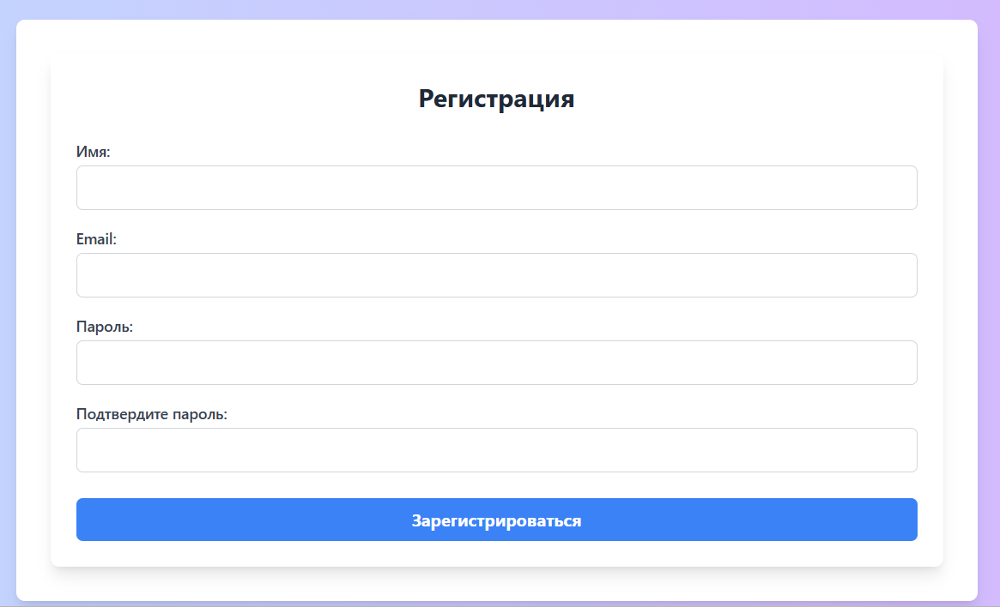
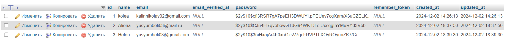

# Лабораторная работа №4. Формы и валидация данных

## Цель работы

Познакомиться с основами создания и управления формами в Laravel.

Освоить механизмы валидации данных на сервере, использовать предустановленные и кастомные правила валидации, а также научиться обрабатывать ошибки и обеспечивать безопасность данных.

## Условие

В данной лабораторной работе будут созданы HTML-формы, реализована проверка данных на стороне сервера и обеспечено безопасное взаимодействие с пользователем, предотвращая уязвимости, такие как `XSS` и `CSRF`.

### №1. Подготовка к работе

1.  Будет продолжена работа с прошлым проектом.
2.  Необходимые переменные в `.env` файле будут проинициализированы для успешного подключения к БД.

### №2. Создание формы
1.  Создайте форму для добавления новой задачи:
    1.  Форма должна содержать следующие поля: `Название`, `Описание`, `Дата выполнения`, `Категория`.
      >Было создано новое поле `due_date` в таблице `Task`. 

    ```php
    @extends('layouts.app')

    @section('content')
        <div class="max-w-4xl mx-auto p-6 bg-white rounded-lg shadow-lg">
            <h1 class="text-2xl font-semibold mb-6">Создать новую задачу</h1>

            <form action="{{ route('tasks.store') }}" method="POST">
                @csrf
                <div class="mb-4">
                    <label for="name" class="block text-sm font-medium text-gray-700">Название</label>
                    <input type="text" class="mt-1 block w-full px-4 py-2 border border-gray-300 rounded-md focus:outline-none focus:ring-2 focus:ring-indigo-500" id="name" name="name" required>
                </div>

                <div class="mb-4">
                    <label for="description" class="block text-sm font-medium text-gray-700">Описание</label>
                    <textarea class="mt-1 block w-full px-4 py-2 border border-gray-300 rounded-md focus:outline-none focus:ring-2 focus:ring-indigo-500" id="description" name="description"></textarea>
                </div>

                <div class="mb-4">
                    <label for="due_date" class="block text-sm font-medium text-gray-700">Дата выполнения</label>
                    <input type="date" class="mt-1 block w-full px-4 py-2 border border-gray-300 rounded-md focus:outline-none focus:ring-2 focus:ring-indigo-500" id="due_date" name="due_date" required value="{{ old('due_date') }}">
                </div>

                <div class="mb-4">
                    <label for="category_id" class="block text-sm font-medium text-gray-700">Категория</label>
                    <select class="mt-1 block w-full px-4 py-2 border border-gray-300 rounded-md focus:outline-none focus:ring-2 focus:ring-indigo-500" id="category_id" name="category_id" required>
                        <option value="">Выберите категорию</option>
                        @foreach($categories as $category)
                            <option value="{{ $category->id }}">{{ $category->name }}</option>
                        @endforeach
                    </select>
                </div>

                <div class="mb-4">
                    <label for="tags" class="block text-sm font-medium text-gray-700">Теги</label>
                    <select class="mt-1 block w-full px-4 py-2 border border-gray-300 rounded-md focus:outline-none focus:ring-2 focus:ring-indigo-500" id="tags" name="tags[]" multiple>
                        @foreach($tags as $tag)
                            <option value="{{ $tag->id }}">{{ $tag->name }}</option>
                        @endforeach
                    </select>
                </div>

                <button type="submit" class="w-full mt-4 px-4 py-2 bg-indigo-600 text-white font-semibold rounded-md hover:bg-indigo-700 focus:outline-none focus:ring-2 focus:ring-indigo-500">Создать задачу</button>
            </form>
        </div>
    @endsection
    ```
    2.  Используйте Blade-шаблоны для рендеринга формы

    

    3.  Поле `Категория` должно быть выпадающим списком, загруженным из таблицы категорий в базе данных. 

    
    
    4.  Обеспечьте, чтобы форма отправляла данные методом POST на маршрут, созданный для обработки данных.
    >Для того, чтобы осуществить отправку данных из формы по соответствующему типу запроса, укажем значение POST в атрибутах формы и также укажем путь к методу, который будет обрабатывать форму: 
    ```php
    <form action="{{ route('tasks.store') }}" method="POST">
    ```
2.  Создайте маршрут `POST /tasks` для сохранения данных из формы в базе данных. Для удобства можно использовать ресурсный контроллер.
3.  Обновите контроллер `TaskController`
    1.  Добавьте метод `create`, который возвращает представление с формой.
    2.  Добавьте метод `store`, который обрабатывает данные из формы и сохраняет их.
    ```php
     public function create()
    {
        $categories = Category::all();
        $tags = Tag::all();
        return view('tasks.create', compact('categories', 'tags'));
    }

    public function store(Request $request)
    {
        $validated = $request->validate([
            'name' => 'required|string|min:3',
            'description' => 'nullable|string|max:500',
            'category_id' => 'required|exists:categories,id',
            'due_date' => 'required|date|after_or_equal:today'
        ]);

        $task = Task::create($validated);

        if ($request->has('tags')) {
            $task->tags()->sync($request->input('tags'));
        }

        return redirect()->route('tasks.index')->with('success', 'Задача успешно создана');
    }
    ```

### №3. Валидация данных на стороне сервера

1.  Реализуйте валидацию данных непосредственно в методе `store` контроллера `TaskController`.
2.  Требования к полям:
    -   `title` --- обязательное, строка, минимальная длина 3 символа.
    -   `description` --- строка, необязательно, максимальная длина 500 символов.
    -   `due_date` --- обязательное, дата, должна быть не меньше сегодняшней даты.
    -   `category_id` --- обязательное, должно существовать в таблице categories.

    ```php
     public function store(Request $request)
    {
        $validated = $request->validate([
            'name' => 'required|string|min:3',
            'description' => 'nullable|string|max:500',
            'category_id' => 'required|exists:categories,id',
            'due_date' => 'required|date|after_or_equal:today'
        ]);

        $task = Task::create($validated);

        if ($request->has('tags')) {
            $task->tags()->sync($request->input('tags'));
        }

        return redirect()->route('tasks.index')->with('success', 'Задача успешно создана');
    }
    ```
3.  Обработайте ошибки валидации и верните их обратно к форме, отображая сообщения об ошибках рядом с полями.
>Пример использования директивы `@error`
```php
<div class="mb-4">
                <label for="name" class="block text-sm font-medium text-gray-700">Название</label>
                <input type="text" class="mt-1 block w-full px-4 py-2 border border-gray-300 rounded-md focus:outline-none focus:ring-2 focus:ring-indigo-500" id="name" name="name" required>
            </div>
            @error('name')
            <div class="text-red-500">{{ $message }}</div>
            @enderror
```

4.  Проверьте корректность работы валидации и убедитесь, что ошибки отображаются правильно.

 


### №4. Создание собственного класса запроса (Request)

1.  На втором этапе создайте собственный класс запроса для валидации формы задачи:
    -   Используйте команду `php artisan make:request CreateTaskRequest`
    -   В классе `CreateTaskRequest` определите правила валидации, аналогичные тем, что были в контроллере.
    ```php
        <?php

    namespace App\Http\Requests;

    use Illuminate\Foundation\Http\FormRequest;

    class CreateTaskRequest extends FormRequest
    {
        public function authorize(): bool
        {
            return true;
        }

        public function rules(): array
        {
            return [
                'name' => 'required|string|min:3',
                'description' => 'nullable|string|max:500',
                'category_id' => 'required|exists:categories,id',
                'due_date' => 'required|date|after_or_equal:today'
            ];
        }
    }
    ```
    -   Обновите метод store контроллера `TaskController` для использования `CreateTaskRequest` вместо стандартного `Request`.
    ```php
    public function store(CreateTaskRequest $request)
    {
        $validated = $request->validated();

        $task = Task::create($validated);

        if ($request->has('tags')) {
            $task->tags()->sync($request->input('tags'));
        }

        return redirect()->route('tasks.index')->with('success', 'Задача успешно создана');
    }
    ```
2.  Добавьте логику валидации для связанных данных
    -   Проверьте, что значение `category_id` действительно существует в базе данных, и оно принадлежит определенной категории.
    ```php
    'category_id' => 'required|exists:categories,id',
    ```
3.  Убедитесь, что данные проходят валидацию через `TaskRequest` и что все ошибки корректно обрабатываются и возвращаются к форме.
    

### №5. Добавление флеш-сообщений

1.  Обновите HTML-форму для отображения подтверждающего сообщения об успешном сохранении задачи (флеш-сообщение).
2.  Обновите метод store контроллера `TaskController`, чтобы добавлять флеш-сообщение при успешном сохранении задачи.

```php
 return redirect()->route('tasks.index')->with('success', 'Задача успешно создана');
 ```
 >Отображение на странице флещ-сообщения
 

### №6. Защита от CSRF

1.  Обеспечение безопасности данных в формах:
    -   Добавьте директиву `@csrf` в форму для защиты от атаки CSRF.
    -   Убедитесь, что форма отправляется только с помощью метода POST.

    ```php
    @extends('layouts.app')

    @section('content')
    <div class="max-w-4xl mx-auto p-6 bg-white rounded-lg shadow-lg">
        <h1 class="text-2xl font-semibold mb-6">Создать новую задачу</h1>

        <form action="{{ route('tasks.store') }}" method="POST">
            @csrf
            <div class="mb-4">
                <label for="name" class="block text-sm font-medium text-gray-700">Название</label>
                <input type="text" class="mt-1 block w-full px-4 py-2 border border-gray-300 rounded-md focus:outline-none focus:ring-2 focus:ring-indigo-500" id="name" name="name" required>
            </div>
    ```
> Здесь видно, что форма отпраляется методом `Post` , а также используется директива `@CSRF - (Cross-Site Request Forgery)` ,чтобы обеспечить безопасность данных в формах и защитить от атак CSRF.

### №7. Обновление задачи

1.  Добавьте возможность редактирования задачи:
    1.  Создайте форму для редактирования задачи. 

    ```php artisan make:request UpdateTaskRequest ```  
``
 

    2.  Создайте новый Request-класс `UpdateTaskRequest` с аналогичными правилами валидации.
    ```php
        <?php

    namespace App\Http\Requests;

    use Illuminate\Foundation\Http\FormRequest;

    class UpdateTaskRequest extends FormRequest
    {
        public function authorize(): bool
        {
            return true;
        }

        public function rules(): array
        {
            return [
                'name' => 'required|string|min:3',
                'description' => 'nullable|string|max:500',
                'category_id' => 'required|exists:categories,id',
                'due_date' => 'required|date|after_or_equal:today'
            ];
        }
    }
    ```
    3.  Создайте маршрут `GET /tasks/{task}/edit` и метод `edit` в контроллере `TaskController`.
    4.  Создайте маршрут `PUT /tasks/{task}` для обновления задачи.
    5.  Обновите метод `update` в контроллере `TaskController` для обработки данных из формы.
    ```php
    public function update(UpdateTaskRequest $request, $id)
    {
        $validated = $request->validated();

        $task = Task::findOrFail($id);
        $task->update($validated);

        if ($request->has('tags')) {
            $task->tags()->sync($request->input('tags'));
        }

        return redirect()->route('tasks.show', $task->id)->with('success', 'Задача успешно обновлена');
    }
    ```

### Дополнительное задание

1.  Создайте кастомное правило валидации, проверяющее, что `description` не содержит запрещенные слова. 
2.  Используйте Artisan-команду: `php artisan make:rule NoRestrictedWords`.
```php
<?php

namespace App\Rules;

use Closure;
use Illuminate\Contracts\Validation\ValidationRule;

class NoRestrictredWords implements ValidationRule
{
    /**
     * Run the validation rule.
     *
     * @param  \Closure(string): \Illuminate\Translation\PotentiallyTranslatedString  $fail
     */
    public function validate(string $attribute, mixed $value, Closure $fail): void
    {
        $restrictedWords = ['depression', 'burnout'];

        foreach ($restrictedWords as $word) {
            if (strpos($value, $word) !== false) {
                $fail("The :attribute contains a restricted word: {$word}");
                return;
            }
        }
    }
}
```
3.  Примените это правило к полю description в классе `CreateTaskRequest`.
```php
 public function rules(): array
    {
        return [
            'name' => 'required|string|min:3',
            'description' => ['nullable' ,'string', 'max:500', new NoRestrictredWords()],
            'category_id' => 'required|exists:categories,id',
            'due_date' => 'required|date|after_or_equal:today'
        ];
    }
```

>Проверка работы кастомного правила валидации 


### Контрольные вопросы

1.  Что такое валидация данных и зачем она нужна?
>__Валидация данных__ — это проверка информации, которую пользователь отправляет в приложение, чтобы убедиться, что она соответствует правилам. Это нужно, чтобы избежать ошибок, защитить приложение от некорректных данных и обеспечить его безопасную и корректную работу.
2.  Как обеспечить защиту формы от CSRF-атак в Laravel?
>Laravel автоматически генерирует CSRF-токен для каждого пользователя сессии. Чтобы включить защиту в форме, нужно добавить директиву `@csrf` внутри HTML-формы:
```php
    <form action="{{ route('tasks.store') }}" method="POST">
         @csrf
        ...
    </form>
```
3.  Как создать и использовать собственные классы запросов (Request) в Laravel?
>Для создания собственного класса запроса используится команду Artisan:

`php artisan make:request CreateTaskRequest ` 

В котором настраиваются правила валидации и авторизации.
4.  Как защитить данные от XSS-атак при выводе в представлении?
>Чтобы защититься от XSS-атак при выводе данных в представлении Laravel, используйте функцию {{ $data }} вместо {!! $data !!}. Она автоматически экранирует опасные символы (например, <, >, "), превращая их в безопасный текст, чтобы злоумышленники не могли выполнить вредоносный код.
```php
 <div>{{ $task->name }}</div>
```